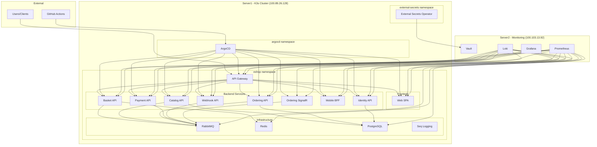
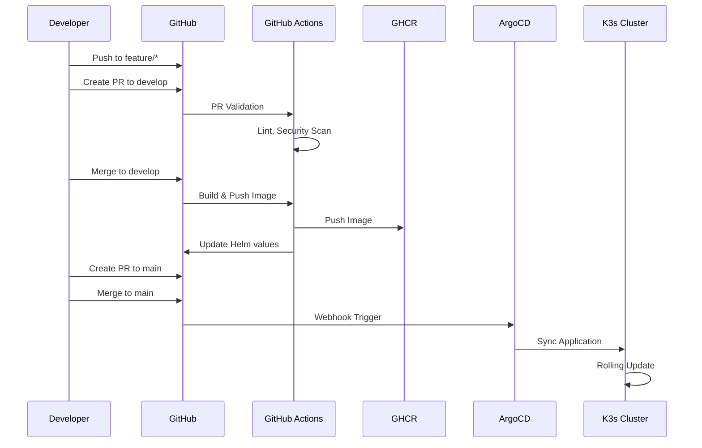
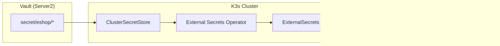

# eShop Platform Infrastructure

Production-grade DevOps platform for Microsoft's eShopOnContainers microservices application, deployed on K3s.

## Architecture



## Platform Overview

| Component | Description |
|-----------|-------------|
| **K3s Cluster** | Server1 (100.89.26.128) - Lightweight Kubernetes |
| **Monitoring Stack** | Server2 (100.103.13.92) - Prometheus, Grafana, Loki, Vault |
| **GitOps** | ArgoCD for continuous deployment |
| **Secrets** | HashiCorp Vault with External Secrets Operator |
| **CI/CD** | GitHub Actions with reusable workflows |

## Services and Responsibilities

| Service | Port | Description | Dependencies |
|---------|------|-------------|--------------|
| **api-gateway** | 80 | Entry point, routing, rate limiting | - |
| **web-spa** | 80 | Angular SPA frontend | API Gateway |
| **basket-api** | 80 | Shopping cart management | Redis, RabbitMQ, Identity |
| **catalog-api** | 80 | Product catalog CRUD | PostgreSQL, RabbitMQ |
| **ordering-api** | 80 | Order processing (CQRS) | PostgreSQL, RabbitMQ, Identity |
| **identity-api** | 80 | Authentication/Authorization | PostgreSQL |
| **payment-api** | 80 | Payment processing | RabbitMQ |
| **webhook-api** | 80 | Webhook subscriptions | RabbitMQ |
| **mobile-bff** | 80 | Mobile backend aggregator | All APIs |
| **ordering-signalr** | 80 | Real-time order updates | RabbitMQ |

## GitOps Flow



### Branching Strategy

```
feature/*  →  develop  →  main (production)
    │            │           │
    │            │           └── Production deployments
    │            └── Integration testing
    └── Feature development
```

## Secrets Management



### Vault Secret Paths

| Path | Contents |
|------|----------|
| `secret/eshop/global` | RABBITMQ_HOST, RABBITMQ_USER, RABBITMQ_PASS |
| `secret/eshop/basket-api` | REDIS_CONNECTION, IDENTITY_URL |
| `secret/eshop/catalog-api` | DB_CONNECTION |
| `secret/eshop/ordering-api` | DB_CONNECTION, IDENTITY_URL |
| `secret/eshop/identity-api` | DB_CONNECTION, CERTIFICATE_PASSWORD |
| `secret/eshop/payment-api` | PAYMENT_GATEWAY_KEY |

## Observability

### Prometheus Alerts

- Service down > 2 minutes
- HTTP 5xx rate > 5%
- Pod restarts > 3 in 5 minutes
- HPA at maximum replicas
- RabbitMQ queue depth > 1000
- Redis memory > 80%
- PostgreSQL connections > 80%

### Grafana Dashboards

- **eShop Overview**: Service status, request rates, error rates
- **Infrastructure**: RabbitMQ, Redis, PostgreSQL metrics

### Loki Log Queries

- Error logs per service
- Slow requests (>1s)
- Authentication failures
- Database connection errors

## How to Deploy from Scratch

### Prerequisites

1. K3s cluster running on Server1
2. ArgoCD installed in `argocd` namespace
3. External Secrets Operator installed
4. Vault running on Server2

### Step 1: Configure Vault Secrets

```bash
# SSH to Server2
ssh server2

# Run the Vault setup script
cd eshop-platform-infra/k8s/external-secrets
chmod +x vault-setup.sh
./vault-setup.sh

# Update placeholder values with real secrets
docker exec portfolio-vault vault kv put secret/eshop/global \
    RABBITMQ_HOST="rabbitmq.eshop.svc.cluster.local" \
    RABBITMQ_USER="eshop" \
    RABBITMQ_PASS="your-secure-password"
```

### Step 2: Deploy with Ansible

```bash
# Full deployment
cd eshop-platform-infra/ansible
ansible-playbook -i inventory/hosts.yml playbooks/deploy-eshop.yml

# Or deploy specific components
ansible-playbook -i inventory/hosts.yml playbooks/deploy-eshop.yml --tags namespace
ansible-playbook -i inventory/hosts.yml playbooks/deploy-eshop.yml --tags rbac
ansible-playbook -i inventory/hosts.yml playbooks/deploy-eshop.yml --tags infrastructure
ansible-playbook -i inventory/hosts.yml playbooks/deploy-eshop.yml --tags apps
```

### Step 3: Verify Deployment

```bash
# SSH to Server1
ssh server1

# Check namespace
sudo kubectl get all -n eshop

# Check ArgoCD applications
sudo kubectl get applications -n argocd

# Check external secrets
sudo kubectl get externalsecrets -n eshop
```

## Individual Service Deployment

Each service auto-deploys when code is pushed to main:

1. Push code to `feature/*` branch
2. Create PR to `develop`
3. PR validation runs (lint, security scan)
4. Merge to `develop` for integration testing
5. Create PR to `main`
6. Merge to `main` triggers:
   - Docker build and push to GHCR
   - Helm values update
   - ArgoCD sync

### Manual ArgoCD Sync

```bash
# Sync specific application
argocd app sync basket-api

# Sync all eshop applications
argocd app sync -l project=eshop
```

## Infrastructure Components

### RabbitMQ
- **Service**: `rabbitmq.eshop.svc.cluster.local`
- **Ports**: 5672 (AMQP), 15672 (Management)
- **Storage**: 5Gi PVC

### Redis
- **Service**: `redis.eshop.svc.cluster.local`
- **Port**: 6379
- **Storage**: 2Gi PVC

### PostgreSQL
- **Service**: `postgresql.eshop.svc.cluster.local`
- **Port**: 5432
- **Storage**: 10Gi PVC
- **Databases**: catalog, identity, ordering

### Seq
- **Service**: `seq.eshop.svc.cluster.local`
- **Port**: 5341
- **Storage**: 5Gi PVC

## Network Architecture

### Network Policies

| Policy | Description |
|--------|-------------|
| `default-deny-all` | Deny all ingress/egress by default |
| `allow-dns` | Allow DNS resolution (kube-system) |
| `allow-api-gateway-to-backends` | API Gateway → Backend services |
| `allow-prometheus-scraping` | Monitoring namespace → eShop pods |
| `allow-egress-to-vault` | All pods → Vault (100.103.13.92:8200) |
| `allow-egress-to-postgresql` | Database clients → PostgreSQL |
| `allow-egress-to-redis` | Cache clients → Redis |
| `allow-egress-to-rabbitmq` | Event bus clients → RabbitMQ |

### Ingress URLs

| Service | URL |
|---------|-----|
| API Gateway | https://api-gateway.jagdevops.co.za |
| Web SPA | https://web-spa.jagdevops.co.za |
| Identity API | https://identity-api.jagdevops.co.za |

## Maintenance Operations

```bash
# Scale down all services
ansible-playbook -i inventory/hosts.yml playbooks/eshop-maintenance.yml -e action=scale_down

# Scale up all services
ansible-playbook -i inventory/hosts.yml playbooks/eshop-maintenance.yml -e action=scale_up

# Drain specific service
ansible-playbook -i inventory/hosts.yml playbooks/eshop-maintenance.yml -e action=drain -e service=basket-api

# Restart a service
ansible-playbook -i inventory/hosts.yml playbooks/eshop-maintenance.yml -e action=restart -e service=catalog-api

# View status
ansible-playbook -i inventory/hosts.yml playbooks/eshop-maintenance.yml -e action=status
```

## Directory Structure

```
eshop-platform-infra/
├── .github/workflows/
│   ├── reusable-build.yml      # Reusable CI workflow
│   ├── develop-ci.yml          # Develop branch CI
│   ├── production-deploy.yml   # Production deployment
│   └── pr-validation.yml       # PR validation
├── helm-charts/
│   ├── basket-api/
│   ├── catalog-api/
│   ├── ordering-api/
│   ├── identity-api/
│   ├── payment-api/
│   ├── webhook-api/
│   ├── web-spa/
│   ├── mobile-bff/
│   ├── ordering-signalr/
│   └── api-gateway/
├── argocd/
│   ├── applications/           # ArgoCD Application manifests
│   └── projects/               # ArgoCD AppProject
├── k8s/
│   ├── namespace.yaml
│   ├── rbac/
│   ├── network-policies/
│   ├── external-secrets/
│   └── infrastructure/
│       ├── rabbitmq/
│       ├── redis/
│       ├── postgresql/
│       └── seq/
├── monitoring/
│   ├── alerts/
│   ├── dashboards/
│   ├── loki/
│   └── prometheus/
└── ansible/
    ├── inventory/
    ├── roles/
    └── playbooks/
```

## Platform Notes

- This platform is **application-agnostic** - it can be adapted for other microservices
- Uses official eShopOnContainers Docker images from MCR as base
- All secrets use `[placeholder]` markers - replace with real values before deployment
- HPA configurations include ignoreDifferences to prevent ArgoCD sync loops

## Contributing

1. Create feature branch from `develop`
2. Make changes
3. Run `helm lint` on modified charts
4. Create PR to `develop`
5. After testing, create PR to `main`

## License

MIT License - See LICENSE file for details.
