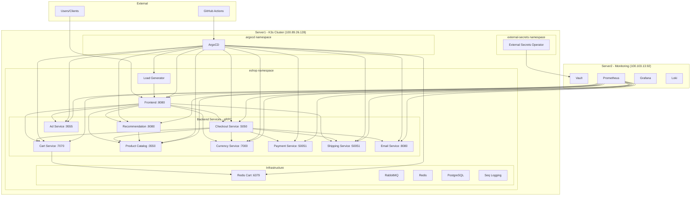
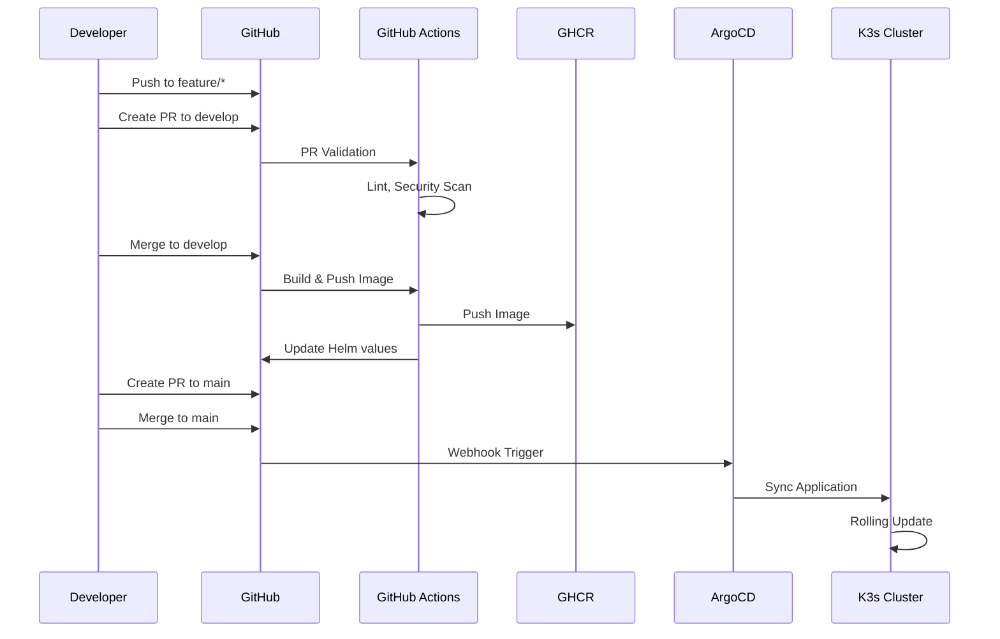

# eShop Platform Infrastructure

Production-grade DevOps platform running Google's Online Boutique microservices demo, deployed on K3s with GitOps.

[](https://github.com/GABRIELS562/eshop-platform-infra/actions)
[](https://opensource.org/licenses/MIT)

## Current Status

| Component | Status | Pods |
|-----------|--------|------|
| **Online Boutique** | ✅ All Healthy | 12/12 Running |
| **Infrastructure** | ✅ All Running | 4/4 Running |
| **ArgoCD** | ✅ Synced | All apps synced |

### Resource Usage (Server1)
| Metric | Usage |
|--------|-------|
| CPU | 15% |
| Memory | 69% (5.5GB/7.8GB) |
| Available | ~2GB headroom |

## Quick Start

```bash
# Check cluster status
ssh server1 "sudo kubectl get pods -n eshop"

# Check ArgoCD applications
ssh server1 "sudo kubectl get applications -n argocd"

# Trigger sync for all apps
ssh server1 "sudo kubectl get applications -n argocd -o name | xargs -I {} sudo kubectl patch {} -n argocd --type merge -p '{\"metadata\":{\"annotations\":{\"argocd.argoproj.io/refresh\":\"hard\"}}}'"

# View frontend logs
ssh server1 "sudo kubectl logs -f deployment/frontend -n eshop"

# Port-forward to access frontend
ssh server1 "sudo kubectl port-forward svc/frontend -n eshop 8080:80"
```

## Quick Links

| Resource | Description |
|----------|-------------|
| [STARTHERE.md](STARTHERE.md) | Comprehensive project documentation |
| [Terraform Modules](#terraform--terragrunt) | Infrastructure as Code |
| [Helm Charts](#directory-structure) | Kubernetes deployments |
| [ArgoCD Apps](#gitops-flow) | GitOps configuration |
| [Ansible Playbooks](#maintenance-operations) | Operational tasks |

## Architecture



## Platform Overview

| Component | Description |
|-----------|-------------|
| **K3s Cluster** | Server1 (100.89.26.128) - Lightweight Kubernetes |
| **Monitoring Stack** | Server2 (100.103.13.92) - Prometheus, Grafana, Loki, Vault |
| **GitOps** | ArgoCD for continuous deployment |
| **Secrets** | HashiCorp Vault with External Secrets Operator |
| **CI/CD** | GitHub Actions with reusable workflows |

## Online Boutique Services

| Service | Port | Protocol | Description | Dependencies |
|---------|------|----------|-------------|--------------|
| **frontend** | 8080 | HTTP | Web UI for the store | All backend services |
| **cartservice** | 7070 | gRPC | Shopping cart management | redis-cart |
| **productcatalogservice** | 3550 | gRPC | Product information | None |
| **currencyservice** | 7000 | gRPC | Currency conversion | None |
| **paymentservice** | 50051 | gRPC | Payment processing | None |
| **shippingservice** | 50051 | gRPC | Shipping quotes | None |
| **emailservice** | 8080 | gRPC | Order confirmation emails | None |
| **checkoutservice** | 5050 | gRPC | Checkout orchestration | cart, product, shipping, payment, email, currency |
| **recommendationservice** | 8080 | gRPC | Product recommendations | productcatalog |
| **adservice** | 9555 | gRPC | Advertisements | None |
| **redis-cart** | 6379 | TCP | Cart storage | None |
| **loadgenerator** | - | - | Traffic simulation | frontend |

## Infrastructure (Portfolio Showcase)

These services are kept deployed to demonstrate infrastructure management skills:

| Service | Port | Description |
|---------|------|-------------|
| **RabbitMQ** | 5672, 15672 | Message broker |
| **Redis** | 6379 | Caching layer |
| **PostgreSQL** | 5432 | Database |
| **Seq** | 5341 | Structured logging |

## GitOps Flow



### Branching Strategy

```
feature/*  →  develop  →  main (production)
    │            │           │
    │            │           └── Production deployments
    │            └── Integration testing
    └── Feature development
```

## Observability

### Prometheus Alerts

- Service down > 2 minutes
- HTTP 5xx rate > 5%
- gRPC P99 latency > 500ms
- Pod restarts > 3 in 5 minutes
- HPA at maximum replicas
- Redis Cart down
- Checkout service unavailable

### Grafana Dashboards

- **eShop Overview**: Service status, request rates, error rates
- **Infrastructure**: RabbitMQ, Redis, PostgreSQL metrics

### Loki Log Queries

- Error logs per service
- gRPC errors
- Slow requests (>1s)
- Checkout flow errors
- Redis connection issues

## Network Policies

| Policy | Description |
|--------|-------------|
| `default-deny-all` | Deny all ingress/egress by default |
| `allow-dns` | Allow DNS resolution (kube-system) |
| `allow-frontend-to-backends` | Frontend → Backend gRPC services |
| `allow-backend-inter-service` | Backend service communication |
| `allow-checkoutservice-egress` | Checkout → All required services |
| `allow-cartservice-to-redis` | Cart service → Redis Cart |
| `allow-prometheus-scraping` | Monitoring namespace → eShop pods |

## Directory Structure

```
eshop-platform-infra/
├── .github/workflows/
│   ├── reusable-build.yml      # Reusable CI workflow
│   ├── develop-ci.yml          # Develop branch CI
│   ├── production-deploy.yml   # Production deployment
│   └── pr-validation.yml       # PR validation
├── helm-charts/
│   ├── frontend/
│   ├── cartservice/
│   ├── productcatalogservice/
│   ├── currencyservice/
│   ├── paymentservice/
│   ├── shippingservice/
│   ├── emailservice/
│   ├── checkoutservice/
│   ├── recommendationservice/
│   ├── adservice/
│   ├── redis-cart/
│   └── loadgenerator/
├── argocd/
│   ├── applications/           # ArgoCD Application manifests
│   └── projects/               # ArgoCD AppProject
├── k8s/
│   ├── namespace.yaml
│   ├── rbac/
│   ├── network-policies/
│   ├── external-secrets/
│   └── infrastructure/
│       ├── rabbitmq/
│       ├── redis/
│       ├── postgresql/
│       └── seq/
├── monitoring/
│   ├── alerts/
│   ├── dashboards/
│   ├── loki/
│   └── prometheus/
└── ansible/
    ├── inventory/
    ├── roles/
    └── playbooks/
```

## Verification Commands

```bash
# Lint all Helm charts
for chart in frontend cartservice productcatalogservice currencyservice paymentservice shippingservice emailservice checkoutservice recommendationservice adservice redis-cart loadgenerator; do
  helm lint helm-charts/$chart
done

# Check pod status
kubectl get pods -n eshop -w

# Check ArgoCD applications
kubectl get applications -n argocd

# Check load generator logs
kubectl logs -n eshop -l app=loadgenerator -f

# Access frontend
kubectl port-forward svc/frontend -n eshop 8080:80
# Open http://localhost:8080
```

## Troubleshooting

### Common Issues & Fixes

| Issue | Cause | Solution |
|-------|-------|----------|
| `CrashLoopBackOff` | gRPC health check fails | Verify K8s 1.24+ for gRPC probes |
| `ImagePullBackOff` | GCR rate limiting | Use authenticated pulls or cache images |
| Service unreachable | Network policy blocking | Check network policies match service ports |
| Frontend blank | Backend services down | Check all gRPC services are running |
| Load generator errors | Frontend not ready | Wait for frontend pod to be ready |

### Useful Commands

```bash
# Check pod events
kubectl describe pod <pod-name> -n eshop

# Check gRPC connectivity
kubectl exec -it deployment/frontend -n eshop -- grpcurl -plaintext productcatalogservice:3550 list

# Force ArgoCD sync
kubectl patch application <app-name> -n argocd --type merge -p '{"metadata":{"annotations":{"argocd.argoproj.io/refresh":"hard"}}}'

# Check resource usage
kubectl top pods -n eshop
```

## Platform Notes

- Uses **Google Online Boutique** - a production-grade microservices demo
- Services communicate via **gRPC** with proper health probes
- **Load generator** provides automatic traffic for realistic metrics
- Infrastructure pods (PostgreSQL, RabbitMQ, Redis) kept for portfolio showcase
- HPA configurations include ignoreDifferences to prevent ArgoCD sync loops

## Contributing

1. Create feature branch from `develop`
2. Make changes
3. Run `helm lint` on modified charts
4. Create PR to `develop`
5. After testing, create PR to `main`

## License

MIT License - See LICENSE file for details.
