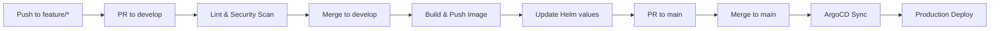

# eShop API Gateway

Unified API Gateway and routing service for the eShopOnContainers platform using YARP (Yet Another Reverse Proxy).

## Overview

The API Gateway provides a single entry point for all client applications, handling request routing, load balancing, rate limiting, and cross-cutting concerns. It routes traffic to appropriate backend microservices and provides aggregation capabilities for complex operations.

## Dependencies

| Dependency | Description |
|------------|-------------|
| **Identity API** | JWT token validation |
| **Catalog API** | Product service routing |
| **Basket API** | Shopping cart routing |
| **Ordering API** | Order service routing |
| **Payment API** | Payment service routing |

### Downstream Services

| Service | Route Prefix | Description |
|---------|--------------|-------------|
| Catalog API | `/c/` | Product catalog |
| Basket API | `/b/` | Shopping cart |
| Ordering API | `/o/` | Order management |
| Mobile BFF | `/m/` | Mobile aggregator |
| Webhook API | `/w/` | Webhooks |

## Configuration

Environment variables (managed via Vault):

```
CATALOG_URL=http://catalog-api.eshop.svc.cluster.local
BASKET_URL=http://basket-api.eshop.svc.cluster.local
ORDERING_URL=http://ordering-api.eshop.svc.cluster.local
PAYMENT_URL=http://payment-api.eshop.svc.cluster.local
IDENTITY_URL=http://identity-api.eshop.svc.cluster.local
MOBILE_BFF_URL=http://mobile-bff.eshop.svc.cluster.local
WEBHOOK_URL=http://webhook-api.eshop.svc.cluster.local
RATE_LIMIT_REQUESTS_PER_SECOND=100
```

### YARP Configuration

```json
{
  "ReverseProxy": {
    "Routes": {
      "catalog-route": {
        "ClusterId": "catalog-cluster",
        "Match": { "Path": "/c/{**catch-all}" },
        "Transforms": [{ "PathRemovePrefix": "/c" }]
      },
      "basket-route": {
        "ClusterId": "basket-cluster",
        "Match": { "Path": "/b/{**catch-all}" },
        "Transforms": [{ "PathRemovePrefix": "/b" }]
      }
    },
    "Clusters": {
      "catalog-cluster": {
        "Destinations": {
          "catalog-api": { "Address": "http://catalog-api/" }
        }
      }
    }
  }
}
```

## Local Development

### Prerequisites

- .NET 8 SDK
- Docker
- Running backend services (or mock servers)

### Build

```bash
docker build -t api-gateway .
```

### Run

```bash
docker run -p 5200:80 \
  -e CatalogUrl="http://localhost:5101" \
  -e BasketUrl="http://localhost:5103" \
  -e OrderingUrl="http://localhost:5102" \
  -e IdentityUrl="http://localhost:5105" \
  api-gateway
```

## API Routes

### Catalog Routes

| Method | Gateway Route | Downstream |
|--------|---------------|------------|
| GET | `/c/api/v1/catalog/items` | Catalog API |
| GET | `/c/api/v1/catalog/items/{id}` | Catalog API |
| GET | `/c/api/v1/catalog/catalogtypes` | Catalog API |
| GET | `/c/api/v1/catalog/catalogbrands` | Catalog API |

### Basket Routes

| Method | Gateway Route | Downstream |
|--------|---------------|------------|
| GET | `/b/api/v1/basket/{id}` | Basket API |
| POST | `/b/api/v1/basket` | Basket API |
| DELETE | `/b/api/v1/basket/{id}` | Basket API |
| POST | `/b/api/v1/basket/checkout` | Basket API |

### Ordering Routes

| Method | Gateway Route | Downstream |
|--------|---------------|------------|
| GET | `/o/api/v1/orders` | Ordering API |
| GET | `/o/api/v1/orders/{id}` | Ordering API |
| PUT | `/o/api/v1/orders/cancel` | Ordering API |
| PUT | `/o/api/v1/orders/ship` | Ordering API |

### Health Endpoints

- `GET /health/live` - Liveness probe
- `GET /health/ready` - Readiness probe (includes downstream checks)

## Features

| Feature | Description |
|---------|-------------|
| Request Routing | Route requests to appropriate microservices |
| Load Balancing | Round-robin and weighted load balancing |
| Rate Limiting | Protect services from overload |
| Authentication | JWT token validation and forwarding |
| CORS | Cross-origin resource sharing |
| Caching | Response caching for GET requests |
| Circuit Breaker | Fault tolerance for downstream failures |
| Request Aggregation | Combine multiple service calls |

## Pipeline



Workflow file: `.github/workflows/pipeline.yml`

## Architecture

```
                         +------------------+
                         |   Load Balancer  |
                         +--------+---------+
                                  |
                         +--------v---------+
                         |   API Gateway    |
                         +--------+---------+
                                  |
         +------------+-----------+-----------+------------+
         |            |           |           |            |
+--------v---+ +------v-----+ +---v----+ +---v----+ +-----v------+
| Catalog API| | Basket API | |Ordering| |Payment | | Mobile BFF |
+------------+ +------------+ | API    | | API    | +------------+
                              +--------+ +--------+
```

## Related Resources

- [Platform Infrastructure](https://github.com/GABRIELS562/eshop-platform-infra)
- [eShopOnContainers](https://github.com/dotnet-architecture/eShopOnContainers)

## License

MIT License
