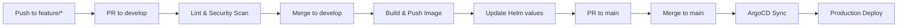

# eShop Catalog API

Product catalog management microservice for the eShopOnContainers platform.

## Overview

The Catalog API provides product catalog management capabilities including browsing, searching, and filtering products. It uses PostgreSQL for persistent storage and supports product images via Azure Blob Storage or local file system.

## Dependencies

| Dependency | Description |
|------------|-------------|
| **PostgreSQL** | Product catalog database |
| **RabbitMQ** | Event bus for integration events |
| **Azure Blob Storage** | Product image storage (optional) |

### RabbitMQ Topics

| Event | Direction | Description |
|-------|-----------|-------------|
| `ProductPriceChangedIntegrationEvent` | Publish | Notifies when product price changes |
| `OrderStockConfirmedIntegrationEvent` | Subscribe | Confirms stock availability for orders |
| `OrderStockRejectedIntegrationEvent` | Publish | Rejects orders when stock unavailable |

## Configuration

Environment variables (managed via Vault):

```
POSTGRES_CONNECTION=Host=postgres;Database=CatalogDb;Username=catalog;Password=[from-vault]
RABBITMQ_HOST=rabbitmq.eshop.svc.cluster.local
RABBITMQ_USER=eshop
RABBITMQ_PASS=[from-vault]
AZURE_STORAGE_CONNECTION=[from-vault]
PICS_BASE_URL=http://localhost:5101/api/v1/catalog/items/{0}/pic/
```

## Local Development

### Prerequisites

- .NET 8 SDK
- Docker
- PostgreSQL (local or container)

### Build

```bash
docker build -t catalog-api .
```

### Run

```bash
docker run -p 5101:80 \
  -e ConnectionString="Host=localhost;Database=CatalogDb;Username=postgres;Password=postgres" \
  -e EventBusConnection="localhost" \
  catalog-api
```

### Database Migration

```bash
dotnet ef database update --project src/Services/Catalog/Catalog.API
```

## API Endpoints

| Method | Endpoint | Description |
|--------|----------|-------------|
| GET | `/api/v1/catalog/items` | Get paginated catalog items |
| GET | `/api/v1/catalog/items/{id}` | Get item by ID |
| GET | `/api/v1/catalog/items/by` | Get items by IDs |
| GET | `/api/v1/catalog/items/{id}/pic` | Get item picture |
| GET | `/api/v1/catalog/items/type/{typeId}/brand/{brandId}` | Filter by type and brand |
| GET | `/api/v1/catalog/items/withname/{name}` | Search by name |
| GET | `/api/v1/catalog/catalogtypes` | Get catalog types |
| GET | `/api/v1/catalog/catalogbrands` | Get catalog brands |
| PUT | `/api/v1/catalog/items` | Update item |
| POST | `/api/v1/catalog/items` | Create item |
| DELETE | `/api/v1/catalog/items/{id}` | Delete item |

### Health Endpoints

- `GET /health/live` - Liveness probe
- `GET /health/ready` - Readiness probe (includes database check)

## Pipeline



Workflow file: `.github/workflows/pipeline.yml`

## Related Resources

- [Platform Infrastructure](https://github.com/GABRIELS562/eshop-platform-infra)
- [eShopOnContainers](https://github.com/dotnet-architecture/eShopOnContainers)

## License

MIT License
