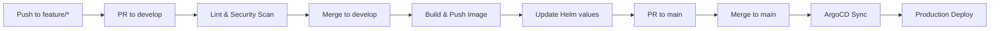

# eShop Ordering API

Order processing microservice implementing CQRS (Command Query Responsibility Segregation) pattern for the eShopOnContainers platform.

## Overview

The Ordering API handles all order-related operations using Domain-Driven Design (DDD) and CQRS patterns. It manages the complete order lifecycle from creation through fulfillment, integrating with payment and inventory services via event-driven communication.

## Dependencies

| Dependency | Description |
|------------|-------------|
| **SQL Server** | Order database with Event Sourcing |
| **RabbitMQ** | Event bus for integration events |
| **Identity API** | User authentication and authorization |
| **Catalog API** | Product validation |
| **Payment API** | Payment processing |

### RabbitMQ Topics

| Event | Direction | Description |
|-------|-----------|-------------|
| `UserCheckoutAcceptedIntegrationEvent` | Subscribe | Initiates order creation from basket checkout |
| `OrderStartedIntegrationEvent` | Publish | Notifies order creation started |
| `OrderStatusChangedToAwaitingValidationIntegrationEvent` | Publish | Order awaiting stock validation |
| `OrderStatusChangedToPaidIntegrationEvent` | Publish | Order payment confirmed |
| `OrderStatusChangedToShippedIntegrationEvent` | Publish | Order shipped |
| `OrderStatusChangedToCancelledIntegrationEvent` | Publish | Order cancelled |
| `GracePeriodConfirmedIntegrationEvent` | Subscribe | Grace period for order cancellation expired |
| `OrderPaymentSucceededIntegrationEvent` | Subscribe | Payment succeeded |
| `OrderPaymentFailedIntegrationEvent` | Subscribe | Payment failed |
| `OrderStockConfirmedIntegrationEvent` | Subscribe | Stock validated |
| `OrderStockRejectedIntegrationEvent` | Subscribe | Stock validation failed |

## Configuration

Environment variables (managed via Vault):

```
SQLSERVER_CONNECTION=Server=sqlserver;Database=OrderingDb;User Id=sa;Password=[from-vault]
IDENTITY_URL=http://identity-api.eshop.svc.cluster.local
RABBITMQ_HOST=rabbitmq.eshop.svc.cluster.local
RABBITMQ_USER=eshop
RABBITMQ_PASS=[from-vault]
GRACEPERIOD_TIME=1
SUBS_URL=http://ordering-signalr.eshop.svc.cluster.local
```

## Local Development

### Prerequisites

- .NET 8 SDK
- Docker
- SQL Server (local or container)

### Build

```bash
docker build -t ordering-api .
```

### Run

```bash
docker run -p 5102:80 \
  -e ConnectionString="Server=localhost;Database=OrderingDb;User Id=sa;Password=Pass@word" \
  -e IdentityUrl="http://localhost:5105" \
  -e EventBusConnection="localhost" \
  ordering-api
```

### Database Migration

```bash
dotnet ef database update --project src/Services/Ordering/Ordering.Infrastructure
```

## API Endpoints

| Method | Endpoint | Description |
|--------|----------|-------------|
| GET | `/api/v1/orders` | Get orders for current user |
| GET | `/api/v1/orders/{orderId}` | Get order by ID |
| GET | `/api/v1/orders/cardtypes` | Get supported card types |
| PUT | `/api/v1/orders/cancel` | Cancel order |
| PUT | `/api/v1/orders/ship` | Ship order |
| POST | `/api/v1/orders/draft` | Create draft order from basket |

### Health Endpoints

- `GET /health/live` - Liveness probe
- `GET /health/ready` - Readiness probe (includes database check)

## Pipeline



Workflow file: `.github/workflows/pipeline.yml`

## Related Resources

- [Platform Infrastructure](https://github.com/GABRIELS562/eshop-platform-infra)
- [eShopOnContainers](https://github.com/dotnet-architecture/eShopOnContainers)

## License

MIT License
