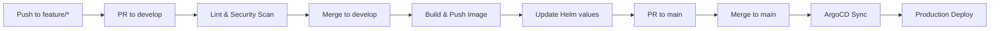

# eShop Ordering SignalR

Real-time order updates microservice using SignalR WebSocket hub for the eShopOnContainers platform.

## Overview

The Ordering SignalR service provides real-time notifications to connected clients when order status changes occur. It subscribes to order integration events from RabbitMQ and broadcasts updates to authenticated users via SignalR WebSocket connections.

## Dependencies

| Dependency | Description |
|------------|-------------|
| **Redis** | SignalR backplane for scale-out |
| **RabbitMQ** | Event bus for order status events |
| **Identity API** | User authentication for hub connections |

### RabbitMQ Topics

| Event | Direction | Description |
|-------|-----------|-------------|
| `OrderStatusChangedToAwaitingValidationIntegrationEvent` | Subscribe | Order awaiting validation |
| `OrderStatusChangedToStockConfirmedIntegrationEvent` | Subscribe | Stock confirmed |
| `OrderStatusChangedToPaidIntegrationEvent` | Subscribe | Payment completed |
| `OrderStatusChangedToShippedIntegrationEvent` | Subscribe | Order shipped |
| `OrderStatusChangedToCancelledIntegrationEvent` | Subscribe | Order cancelled |
| `OrderStatusChangedToSubmittedIntegrationEvent` | Subscribe | Order submitted |

## Configuration

Environment variables (managed via Vault):

```
REDIS_CONNECTION=redis.eshop.svc.cluster.local:6379
IDENTITY_URL=http://identity-api.eshop.svc.cluster.local
RABBITMQ_HOST=rabbitmq.eshop.svc.cluster.local
RABBITMQ_USER=eshop
RABBITMQ_PASS=[from-vault]
AZURE_SIGNALR_CONNECTION=[from-vault]  # Optional: Azure SignalR Service
```

## Local Development

### Prerequisites

- .NET 8 SDK
- Docker
- Redis (local or container)
- RabbitMQ (local or container)

### Build

```bash
docker build -t ordering-signalr .
```

### Run

```bash
docker run -p 5112:80 \
  -e IdentityUrl="http://localhost:5105" \
  -e EventBusConnection="localhost" \
  -e SignalrStoreConnectionString="localhost:6379" \
  ordering-signalr
```

## SignalR Hub

### Hub Endpoint

```
/hub/notificationhub
```

### Client Methods (Server to Client)

| Method | Parameters | Description |
|--------|------------|-------------|
| `UpdatedOrderState` | `orderId`, `status` | Order status changed |

### Hub Methods (Client to Server)

| Method | Parameters | Description |
|--------|------------|-------------|
| `Subscribe` | `orderId` | Subscribe to order updates |
| `Unsubscribe` | `orderId` | Unsubscribe from order updates |

### Client Connection Example

```javascript
const connection = new signalR.HubConnectionBuilder()
    .withUrl('/hub/notificationhub', {
        accessTokenFactory: () => authToken
    })
    .withAutomaticReconnect()
    .build();

connection.on('UpdatedOrderState', (orderId, status) => {
    console.log(`Order ${orderId} status: ${status}`);
});

await connection.start();
```

### Health Endpoints

- `GET /health/live` - Liveness probe
- `GET /health/ready` - Readiness probe (includes Redis check)

## Scaling

SignalR uses Redis backplane for horizontal scaling:

```
                    +----------------+
                    |   Load Balancer |
                    +--------+-------+
                             |
         +-------------------+-------------------+
         |                   |                   |
+--------v-------+  +--------v-------+  +--------v-------+
| SignalR Pod 1  |  | SignalR Pod 2  |  | SignalR Pod 3  |
+--------+-------+  +--------+-------+  +--------+-------+
         |                   |                   |
         +-------------------+-------------------+
                             |
                    +--------v-------+
                    |     Redis      |
                    | (Backplane)    |
                    +----------------+
```

## Pipeline



Workflow file: `.github/workflows/pipeline.yml`

## Related Resources

- [Platform Infrastructure](https://github.com/GABRIELS562/eshop-platform-infra)
- [eShopOnContainers](https://github.com/dotnet-architecture/eShopOnContainers)

## License

MIT License
