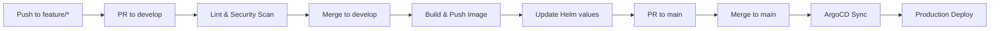

# eShop Web SPA

Angular Single Page Application frontend for the eShopOnContainers platform.

## Overview

The Web SPA is the main web frontend for the eShop platform, built with Angular. It provides a responsive shopping experience including product browsing, shopping cart, checkout, and order management. The application communicates with backend services through the API Gateway.

## Dependencies

| Dependency | Description |
|------------|-------------|
| **API Gateway** | Backend API routing |
| **Identity API** | User authentication (OAuth 2.0/OIDC) |
| **SignalR Hub** | Real-time order updates |

### Backend Services (via API Gateway)

| Service | Description |
|---------|-------------|
| Catalog API | Product browsing |
| Basket API | Shopping cart |
| Ordering API | Order management |

## Configuration

Environment variables (runtime configuration via nginx):

```
API_GATEWAY_URL=http://api-gateway.eshop.svc.cluster.local
IDENTITY_URL=http://identity-api.eshop.svc.cluster.local
SIGNALR_HUB_URL=http://ordering-signalr.eshop.svc.cluster.local
```

### Angular Environment Configuration

```typescript
// environment.prod.ts
export const environment = {
  production: true,
  apiGatewayUrl: '${API_GATEWAY_URL}',
  identityUrl: '${IDENTITY_URL}',
  signalrHubUrl: '${SIGNALR_HUB_URL}'
};
```

## Local Development

### Prerequisites

- Node.js 20+
- Angular CLI
- Docker (for containerized development)

### Install Dependencies

```bash
npm install
```

### Development Server

```bash
ng serve
```

Navigate to `http://localhost:4200/`

### Build

```bash
# Development build
ng build

# Production build
ng build --configuration production
```

### Docker Build

```bash
docker build -t web-spa .
```

### Run Container

```bash
docker run -p 8080:80 web-spa
```

## Features

| Feature | Description |
|---------|-------------|
| Product Catalog | Browse and search products |
| Shopping Cart | Add/remove items, update quantities |
| User Authentication | Login, register, profile management |
| Checkout | Address, payment, order confirmation |
| Order History | View past orders and status |
| Real-time Updates | Order status via SignalR |

## API Endpoints Consumed

| Endpoint | Description |
|----------|-------------|
| `GET /api/v1/catalog/items` | Fetch products |
| `GET /api/v1/basket/{id}` | Get shopping cart |
| `POST /api/v1/basket/checkout` | Checkout |
| `GET /api/v1/orders` | Order history |
| `WS /hub/notificationhub` | Real-time notifications |

### Health Endpoints

- `GET /health` - Nginx health check

## Pipeline



Workflow file: `.github/workflows/pipeline.yml`

## Related Resources

- [Platform Infrastructure](https://github.com/GABRIELS562/eshop-platform-infra)
- [eShopOnContainers](https://github.com/dotnet-architecture/eShopOnContainers)

## License

MIT License
