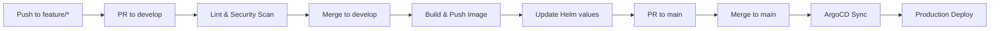

# eShop Webhook API

Webhook subscription and delivery microservice for the eShopOnContainers platform.

## Overview

The Webhook API allows external systems to subscribe to eShop events and receive HTTP callbacks when events occur. It manages webhook subscriptions, event filtering, and reliable delivery with retry mechanisms.

## Dependencies

| Dependency | Description |
|------------|-------------|
| **SQL Server** | Webhook subscription database |
| **RabbitMQ** | Event bus for integration events |
| **Identity API** | User authentication |

### RabbitMQ Topics

| Event | Direction | Description |
|-------|-----------|-------------|
| `OrderStatusChangedToShippedIntegrationEvent` | Subscribe | Triggers webhook for shipped orders |
| `OrderStatusChangedToPaidIntegrationEvent` | Subscribe | Triggers webhook for paid orders |
| `ProductPriceChangedIntegrationEvent` | Subscribe | Triggers webhook for price changes |

### Webhook Event Types

| Event Type | Description |
|------------|-------------|
| `OrderShipped` | Fired when an order is shipped |
| `OrderPaid` | Fired when order payment is confirmed |
| `ProductPriceChanged` | Fired when product price changes |

## Configuration

Environment variables (managed via Vault):

```
SQLSERVER_CONNECTION=Server=sqlserver;Database=WebhooksDb;User Id=sa;Password=[from-vault]
IDENTITY_URL=http://identity-api.eshop.svc.cluster.local
RABBITMQ_HOST=rabbitmq.eshop.svc.cluster.local
RABBITMQ_USER=eshop
RABBITMQ_PASS=[from-vault]
WEBHOOK_RETRY_COUNT=3
WEBHOOK_RETRY_INTERVAL_SECONDS=60
```

## Local Development

### Prerequisites

- .NET 8 SDK
- Docker
- SQL Server (local or container)

### Build

```bash
docker build -t webhook-api .
```

### Run

```bash
docker run -p 5113:80 \
  -e ConnectionString="Server=localhost;Database=WebhooksDb;User Id=sa;Password=Pass@word" \
  -e IdentityUrl="http://localhost:5105" \
  -e EventBusConnection="localhost" \
  webhook-api
```

### Database Migration

```bash
dotnet ef database update --project src/Services/Webhooks/Webhooks.API
```

## API Endpoints

| Method | Endpoint | Description |
|--------|----------|-------------|
| GET | `/api/v1/webhooks` | List user's webhook subscriptions |
| GET | `/api/v1/webhooks/{id}` | Get webhook subscription by ID |
| POST | `/api/v1/webhooks` | Create webhook subscription |
| DELETE | `/api/v1/webhooks/{id}` | Delete webhook subscription |

### Webhook Subscription Payload

```json
{
  "url": "https://example.com/webhook",
  "token": "secret-token",
  "type": "OrderShipped",
  "grantUrl": "https://example.com/webhook/grant"
}
```

### Health Endpoints

- `GET /health/live` - Liveness probe
- `GET /health/ready` - Readiness probe (includes database check)

## Pipeline



Workflow file: `.github/workflows/pipeline.yml`

## Related Resources

- [Platform Infrastructure](https://github.com/GABRIELS562/eshop-platform-infra)
- [eShopOnContainers](https://github.com/dotnet-architecture/eShopOnContainers)

## License

MIT License
